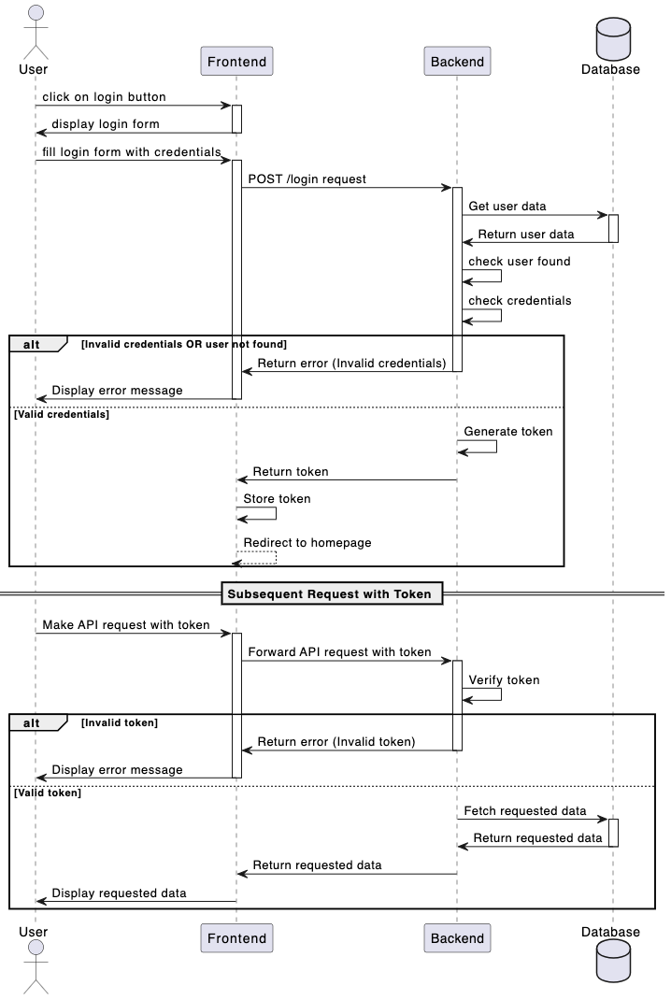

# Correction partie conception

Tu découvriras dans le dossier `projet` le `backend` qui servira d'api pour le `frontend`. Pense à bien lire le README.md du `backend`.

## Maquette

### Figma

Le fichier figma est disponible [ici](./maquettes/Poudlard's%20timetable.fig) pour un import dans figma.

### Maquette mobile

### Maquette desktop

## Zonage

## User stories

- En tant que **visiteur**, je veux pouvoir **voir** les membres du staff
- En tant que **visiteur**, je veux pouvoir **voir** les matières
- En tant qu'**utilisateur**, je veux pouvoir **me connecter** à mon compte
- En tant qu'**utilisateur**, je veux pouvoir **sélectionner** le rôle avec lequel je me connecte

- En tant que **sorcier**, je veux pouvoir **voir** mon emploi du temps
- En tant que **sorcier**, je veux pouvoir **voir** la liste de mes camarades
- En tant que **sorcier**, je veux pouvoir **voir** l'emploi du temps de mes camarades
- En tant que **sorcier**, je veux pouvoir **voir** la liste des membres du staff
- En tant que **sorcier**, je veux pouvoir **voir** l'emploi du temps des membres du staff

- En tant que **membre du staff**, je veux pouvoir **ajouter** une matière
- En tant que **membre du staff**, je veux pouvoir **modifier** une matière
- En tant que **membre du staff**, je veux pouvoir **supprimer** une matière
- En tant que **membre du staff**, je veux pouvoir **ajouter** une classe
- En tant que **membre du staff**, je veux pouvoir **modifier** une classe
- En tant que **membre du staff**, je veux pouvoir **supprimer** une classe
- En tant que **membre du staff**, je veux pouvoir **ajouter** une salle
- En tant que **membre du staff**, je veux pouvoir **modifier** une salle
- En tant que **membre du staff**, je veux pouvoir **supprimer** une salle
- En tant que **membre du staff**, je veux pouvoir **ajouter** une maison
- En tant que **membre du staff**, je veux pouvoir **modifier** une maison
- En tant que **membre du staff**, je veux pouvoir **supprimer** une maison
- En tant que **membre du staff**, je veux pouvoir **ajouter** un sorcier
- En tant que **membre du staff**, je veux pouvoir **modifier** un sorcier
- En tant que **membre du staff**, je veux pouvoir **supprimer** un sorcier
- En tant que **membre du staff**, je veux pouvoir **assigner** un rôle à un sorcier
- En tant que **membre du staff**, je veux pouvoir **supprimer** un rôle à un sorcier

## Use cases

## Diagramme d'entités associations

## Diagramme de séquence

Système d'authentification avec token JWT :

## Diagramme d'activité

Connexion à un compte ayant plusieurs rôles :

## Diagramme d'architecture Docker

## Diagramme de deploiement CI/CD

