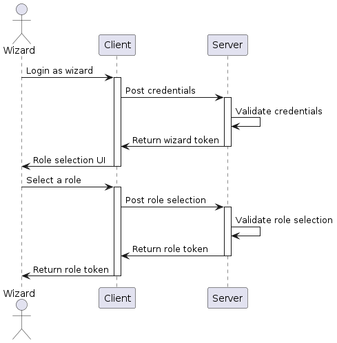

# Poudlard's API

## Projet en cours de développement

Le projet backend étant encore en cours de développement, il manque la possibilité d'ajouter un rôle à un sorcier existant mais aussi de créer un sorcier avec un rôle.

## Swagger

La liste des routes disponibles est visible dans le fichier `swagger-output.json`.
L'extension VSCode `Swagger Viewer` permet de visualiser le fichier dans une webview : <https://marketplace.visualstudio.com/items?itemName=Arjun.swagger-viewer>

Encore mieux, une fois le serveur lançé, rends toi directement sur la homepage pour voir la documentation de l'API: <http://localhost:3000>

## Visibilité des routes

Il y a 3 niveaux de visibilité des routes :

- **public** : accessible sans authentification
- **wizard** : accessible par un sorcier qui vient de s'authentifier sans avoir de rôle spécifique
- **role** : accessible par un sorcier authentifié et qui a un rôle spécifique

## Authentification

L'authentification se fait par le biais d'un token JWT. Ce token est généré par le serveur et doit être envoyé dans le header `Authorization` de chaque requête.

